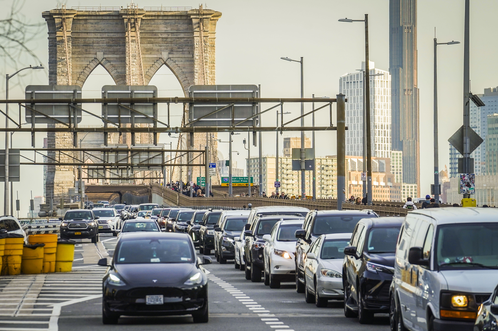

## Exploring patterns, trends, and risk factors in NYC crashes

**Collaborators**  
- Daniel Jiao (dj2764)  - Yuyang Wang (yw4660)
- Xinyu Wang (xw3106)
- Haoyi Tan (ht2717)

---

## Overview

Motor vehicle collisions (MVCs) represent a major public safety issue in New York City.

Using data from NYC Open Data, this project explores:

- When collisions occur  
- Where they occur  
- How severe they are  
- Which factors are associated with injuries and fatalities

This website presents descriptive analyses, spatial mapping, and statistical modeling results to better understand collision patterns and risk factors across the five boroughs.

---

## Data Sources

This project integrates **two major datasets**:

### **1. NYC Motor Vehicle Collisions – Crashes (Primary Dataset)**  
- **Publisher:** NYPD  
- **Source:** NYC Open Data  
- **Link:** https://data.cityofnewyork.us/Public-Safety/Motor-Vehicle-Collisions-Crashes/h9gi-nx95  
- **Description:**  
  Each row represents a crash and includes:
  - date and time  
  - location (borough, longitude, latitude)  
  - injuries & fatalities  
  - contributing factors  
  - vehicle types  

---

### **2. NYC Traffic Volume (Supplementary Dataset)**  
- **Source:** NYC Open Data
- **Link:** https://data.cityofnewyork.us/Transportation/Automated-Traffic-Volume-Counts/7ym2-wayt/about_data
- **Description:**  
  Hourly traffic counts from NYC Department of Transportation traffic sensors.  
  These data help contextualize collision rates by describing **exposure**, i.e., periods of heavier or lighter road usage.

Examples of variables include:
- Sensor ID  
- Borough  
- Hourly vehicle counts  
- Roadway type  

This dataset is used to explore whether **higher traffic volume** corresponds to increased collision frequency.

---

## Research Questions

Bringing together collision, traffic, and weather data allows us to answer the following questions:

1. **When** do collisions most frequently occur?  
2. **Where** do crashes occur, and which boroughs exhibit the highest risk?  
3. **How severe** are collisions, and how do injury patterns vary across NYC?  
4. **To what**  extent do environmental factors—such as weather and traffic volume—affect collision frequency or injury risk? 
5. **Which** contributing factors (e.g., driver behavior, road conditions) are most strongly associated with injuries?

---

## Website Structure

- **Home** – Project overview  
- **About / Data** – Data source and cleaning  
- **Exploratory Analyses → Overview** – Basic summaries  
- **Exploratory Analyses → Time Trends** – Temporal patterns  
- **Mapping** – Collision locations in NYC  
- **Modeling** – Statistical models
- **Correlation** – Impacts of weather and traffic volume 
- **Project Report** – Full report  

---

## Acknowledgements

This project is completed as part of **P8105: Data Science** at the Columbia University Mailman School of Public Health.
